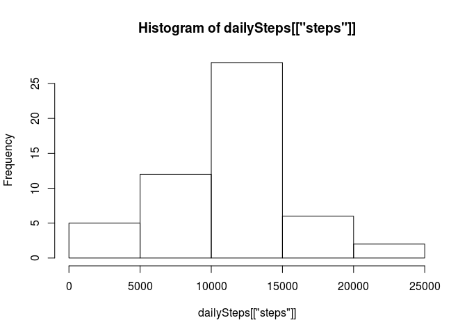
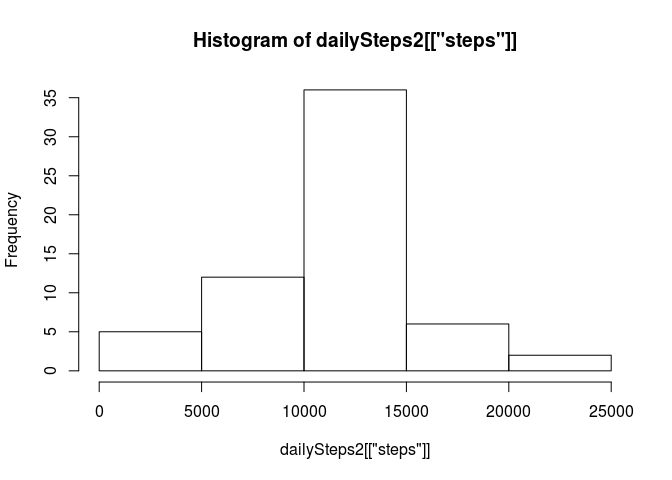

# Reproducible Research: Peer Assessment 1

This is an analysis of activity data containing numbers of steps taken on specific 5 minute intervals during a given day.

## Loading and preprocessing the data


```r
if (!file.exists("activity.csv")) {
  unzip("activity.zip")
}
activity <- read.csv("activity.csv", header = TRUE, sep = ",")
dailySteps <- aggregate(steps ~ date, activity, sum)
intervalSteps <- aggregate(steps ~ interval, activity, mean)
```

## What is mean total number of steps taken per day?

How many steps did the test subjects take daily?

```r
hist(dailySteps[["steps"]])
```

 

The mean and median number of daily steps:


```r
mean(dailySteps[["steps"]])
```

```
## [1] 10766.19
```

```r
median(dailySteps[["steps"]])
```

```
## [1] 10765
```


## What is the average daily activity pattern?

Time series plot of the 5-minute interval (x-axis) and the average number of steps taken, averaged across all days (y-axis)


```r
plot(intervalSteps, type="l")
```

 

The biggest number of steps in an interval is


```r
maxSteps = max(intervalSteps[["steps"]])
maxSteps
```

```
## [1] 206.1698
```

in interval:


```r
intervalSteps[intervalSteps$steps == maxSteps, ][["interval"]]
```

```
## [1] 835
```


## Imputing missing values

Total number of missing values in the dataset (i.e. the total number of rows with NAs)


```r
nrow(activity[!complete.cases(activity),])
```

```
## [1] 2304
```

We will fill in all of the missing values in the dataset. We will use the mean for that 5-minute interval.


```r
getSteps <- Vectorize(function(inter) {
  intervalSteps[intervalSteps$interval == inter,][["steps"]]
})

activityFull <- activity
# activityFull$steps <- getSteps(activityFull$interval)
# Column1[is.na(Column1)] <- round(mean(Column1, na.rm = TRUE))
activityFull[is.na(activityFull$steps),]$steps <- getSteps(activityFull[is.na(activityFull$steps),]$interval)

# nrow(activityFull[!complete.cases(activityFull),])
dailySteps2 <- aggregate(steps ~ date, activityFull, sum)
```

Check the histogram and mean and median values with the NA values filled in:


```r
hist(dailySteps2[["steps"]])
```

 

```r
mean(dailySteps2[["steps"]])
```

```
## [1] 10766.19
```

```r
median(dailySteps2[["steps"]])
```

```
## [1] 10766.19
```

The highest value of the histogram is higher with the NA values imputed. Overall the median, mean and histogram values are quite similar with the NA values imputed.

## Are there differences in activity patterns between weekdays and weekends?

Separate steps from weekends and weekdays:

```r
activityFull$dayType <- "weekday"

activityFull$dayType[weekdays(as.Date(activityFull$date)) == 'lauantai'] <- "weekend"
activityFull$dayType[weekdays(as.Date(activityFull$date)) == 'sunnuntai'] <- "weekend"

aggregateActivityFull <- aggregate(steps ~ interval+dayType, activityFull, mean)
```

Plot the daily activity patterns separately for weekends and weekdays:


```r
library(lattice) 
xyplot(steps ~ interval|dayType, type="a", data=aggregateActivityFull, layout=c(1,2))
```

 
